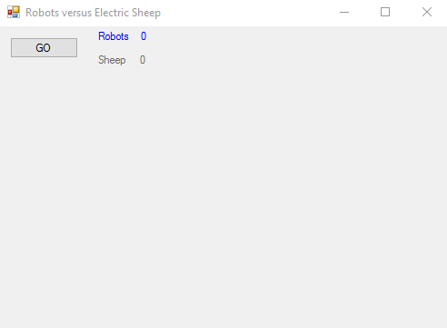

# robots-versus-electric-sheep

Simulation of simple life forms on a grid. Includes basic evolution (mutation and cross over).

This is not a cellular automata, though it may appear to be similar at a glance.

