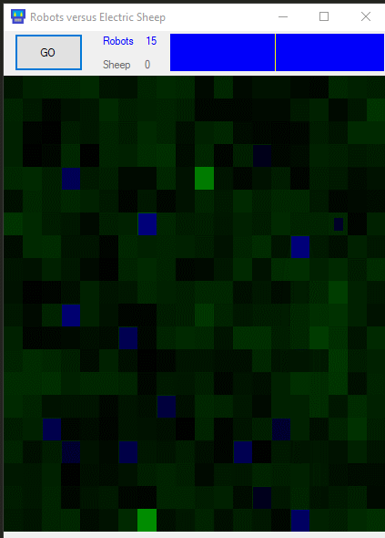

# robots-versus-electric-sheep

Simulation of simple life forms on a grid. Includes basic evolution (mutation and cross over).

This is not a cellular automata, though it may appear to be similar at a glance.

## What is it?

Two species, the blue robots and the gray sheep, wander around a paddock, competing to eat grass.

They can breed only with their own species, and their offspring will inherit genes from both parents (with some mutation possible). Genes control the animal's inquisitiveness and other characteristics.

It is strangely mesmerizing.

## Getting started

Written in C# Windows Forms with Visual Studio 2017 (free).

